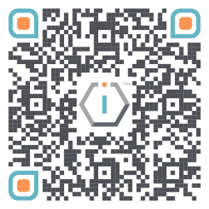

# Project Information

## About

Under the TechUp initiative, the Tech Up Fellowship, is a project by The IO Foundation designed to equip technologists with a solid understanding of the Standards Developing Organizations (SDOs) ecosystem. Participants acquire the necessary skills to engage in the development of digital standards and policies, ensuring that technology prioritizes protecting users by design through the observance of the Data-Centric Digital Rights framework.

The fellowship encourages collaboration and provides opportunities for active participation in SDO work and activities.



## Benefits

Being a Fellow The fellowship will help you to:

* understand how the Standards Developing Organizations' ecosystem functions
* discover which SDOs should matter **to you and your career**
* actively participate actively in the standards and policies that shape the digital ecosystem
* be availed of opportunities to participate in SDO work, activities and meetings
* ensure that technology protects users by design


Fellows receive a certificate for each one of their TechUp Fellowship engagements (check our [Certificates.TheIOFoundation.org](http://certificates.theiofoundation.org) platform).


## Types of fellowship engagements

The TechUp Fellowship is organized around two engagement types:

<table><thead><tr><th width="215"></th><th></th></tr></thead><tbody><tr><td>Activity-specific</td><td>Single meeting engagement focusing on specific work.</td></tr><tr><td>Season-wide</td><td>Full Season engagement with work encompassing a range of objectives. </td></tr><tr><td></td><td></td></tr></tbody></table>

## Resources



This section contains links to resources related to this project.



| Content              | (short)URL                                                                                                                       | QR Code                                                                  |
| -------------------- | -------------------------------------------------------------------------------------------------------------------------------- | ------------------------------------------------------------------------ |
| Project information  | [https://Short.TheIOFoundation.org/fellowship](https://short.theiofoundation.org/fellowship)                                     |  |
| Fellowships Openings | [https://Short.TheIOFoundation.org/tiof-tu-fellowships-openings](https://short.theiofoundation.org/tiof-tu-fellowships-openings) |      |
|                      |                                                                                                                                  |                                                                          |








